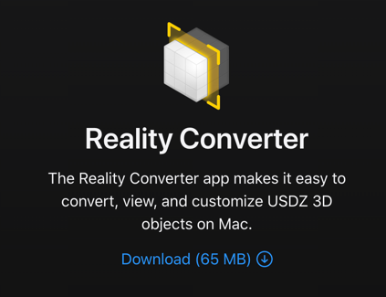

# Augmented Reality - POC Grass

## Installation

*   Download & install the [latest Python release](https://www.python.org/downloads/)
    *    On MacOS, here's how to set it as the [default Python version](https://dev.to/malwarebo/how-to-set-python3-as-a-default-python-version-on-mac-4jjf)
*   Install or update libraries:
    ```
    python3 -m pip install --upgrade pip  # Upgrade PIP installer.
    python3 -m pip install pygltflib      # Install library for writing GLTF (GL Transmission Format) model files.
    python3 -m pip install numpy          # Install numpy mathematics library.
    python3 -m pip install Pillow         # Install Pillow for reading and writing images.
    ```
#### [Install Reality Converter](https://developer.apple.com/augmented-reality/tools/) (converter from GLTF to Universal Scene Description (USD))
USD is the Pixar format for 3D animated models, which is required for using Augmented Reality on iOS (iPhone, iPad) devices.




## Scripts to run
Some Python scripts (open source) were found to create a 3d representation of the image (below for detail of each step)

```
python3 scripts/prepare_images.py --images "examples/images/*.jpg"
python3 scripts/generate_gltf.py --input_csv=examples/examples.csv --input_images=examples/images --output_models=examples/models
python3 scripts/create_html.py --input_models=examples/models --output_html=examples/models/index.html
```

## Prepare images

`prepare_images.py` converts 2D images(jpg, although other formats could be easily supported) to be used in the 3D models. The conversion does a couple of important things:

1.   Replaces the background color with transparent, so we do not want to display the background color when we show in augmented reality. Good for non-rectangular shapes.
2.   Shrinks the image so its not bigger than 4.2 megapixels. This allows mobile phones (especially older ones) to display the 3D model in augmented reality. Failure to limit the image size sometimes causes problems.
Run the following command to prepare the images in the examples directory. It will read from the JPG files, convert, and write out the output as PNG files in the same directory:

```
python3 scripts/prepare_images.py --images "examples/images/*.jpg"
```

> The converted images are stored in `png` format primarily because `jpg` does not natively support an alpha (transparency) channel. Unfortunately, `png` compression seems to be significantly worse for big images, so the resulting files are bigger, and therefore take longer to transfer to the user's devices. It may be worth trying to figure out a way to serve smaller files.
> 
> On the other hand, the mobile device likely needs to decompress the image to its full size to be displayed on the screen. Therefore we will always want to keep a maximum number of pixels per image regardless of how well we can compress it.

## Generate GL Transmission Format (GLTF) models

Mobile devices use the GLTF models for previewing and (in the case of Android) in Augmented Reality mode.

Run the following comment to generate GLTF models in the examples directory:

```
python3 scripts/generate_gltf.py --input_csv=examples/examples.csv --input_images=examples/images --output_models=examples/models
```

Explanation of each parameter:

*   `--input_csv` should point to a CSV file containing one row per image, with columns:
    *    `ID` matching the name of the image file.
    *    `L cm` matching the length (height) in centimeters.
    *    `W cm` matching the width in centimeters.
    *.   All other columns are ignored by the program.
*   `--input_images` is the directory used in the previous step
*   `--output_models` will contain, per image
    *    the `.png` file copied from `--input_images`
    *    the `.gltf` model containing the shape and texture, referring back to the `.png` file

## Generate Universal Scene Description (USD) models

Next, we generate the USD models, which are necessary for the augmented reality on iOS.

We need to convert each `.gltf` file into a corresponding `.usdz` in same directory. The next step depends on which tool you installed earlier.

### Convert to USDZ using the Reality Converter

If you installed Reality Converter (see instructions above), then launch it now and:

1. Open all the `.gltf` files you generated
2. Preview the 3D models to see what they look like
3. Export to `.usdz` files in the same directory

### Notes about converting to USDZ

>   The `.usdz` model is a binary file containing a copy of the `png` image. This unfortunately means that iOS users need to download the image twice: once when they first view the 3D (GLTF) model and then again when they download the USDZ file for agumented reality.
>
>   Theoretically, we should be able to overcome this by using a `.usda` text representation (which allows us to reference the `.png` file instead of copying it) instead of the binary `.usdz`. Unfortunately I wasn't able to get it to work, even after running `usdzconverter model.gltf model.usda` and tweaking the output. Please update the code or contact me if you figure this out.

## Generate HTML

Next, we use the [\<model-viewer\> HTML tag](https://modelviewer.dev/examples/augmentedreality/index.html) to display the 3D models in HTML.

For convenience, run this command to automatically generate HTML for the models in the examples directory:

```
python3 scripts/create_html.py --input_models=examples/models --output_html=examples/models/index.html
```

>   The generated HTML is pretty bare bones. You later probably want to change certain features -- for example, you can [replace the AR button](https://modelviewer.dev/docs/#augmentedreality-slots) or [toggle the Augmented Reality mode from Javascript](https://modelviewer.dev/docs/#entrydocs-augmentedreality-methods-activateAR). Also be sure to check out the [AR examples page](https://modelviewer.dev/examples/augmentedreality/).

Note that the HTML loads the \<model-viewer\> code from a seperate server:

```
    <script type="module" src="https://unpkg.com/@google/model-viewer/dist/model-viewer.min.js"></script>
```

When launching this on your website, you may want to copy `model-viewer.min.js` to minimize dependency on other servers.

## Serve HTML - Development

### Within your local network

To see your website, you can spin up a local web server using Python:

```
cd examples/models
python3 -m http.server 1337
```

Then open your browser to http://localhost:1337. 
The caveat is that desktop browsers can load the 3D model, but don't support augmented reality.

To test the augmented reality feature, you need to load the page on your phone or tablet using [USB remote debugging mode](https://developer.chrome.com/docs/devtools/remote-debugging/).

### On a GitHub Page

The disadvantage of GitHub Pages is that they can take a while to pick up your changes (sometimes 10+ minutes). So it can be a bit annoying when you're making a lot of changes quickly and want to see the results right away.
